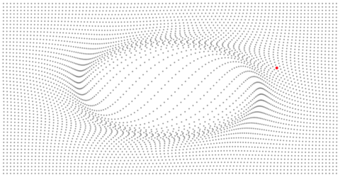
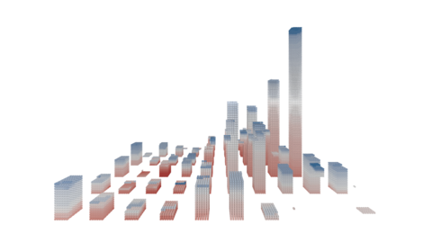
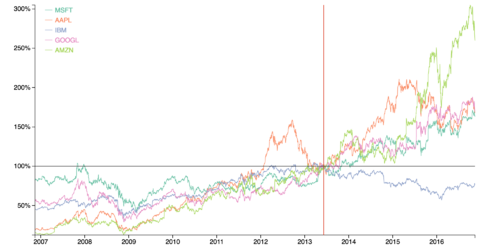
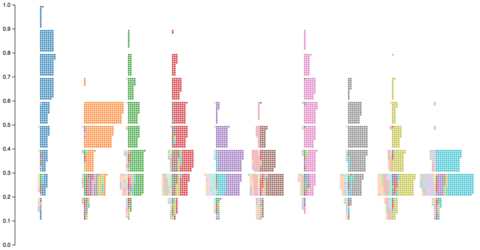
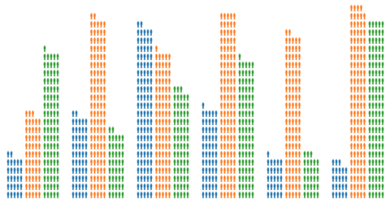
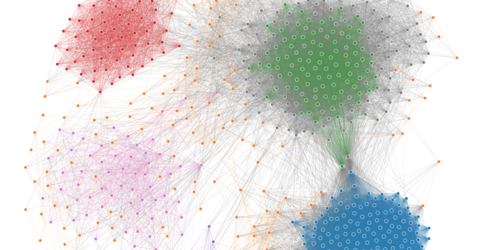

Stardust: GPU-based Visualization Library
====

<ul class="examples group">
    <li><a href="examples/scatterplot"><div class="overlay"><span>Scatterplot</span></div></a></li>
    <li><a href="examples/sanddance"><div class="overlay"><span>SandDance</span></div></a></li>
    <li><a href="examples/index-chart"><div class="overlay"><span>Index Chart</span></div></a></li>
    <li><a href="examples/squares"><div class="overlay"><span>Squares</span></div></a></li>
    <li><a href="examples/isotype"><div class="overlay"><span>Isotype</span></div></a></li>
    <li><a href="examples/graph"><div class="overlay"><span>Force-directed Graph</span></div></a></li>
</ul>


**Stardust** is a library for rendering information visualizations with GPU (WebGL). Stardust provides an easy-to-use
and familiar API for defining shapes and binding data to them. With Stardust, you can render tenth of thousands
of markers and animate them in real time without the hassle of managing WebGL shaders and buffers.

Play with the library in the online playground:

- [Online Playground](https://stardust-vis.github.io/playground/)

Install with npm:

```bash
npm install stardust-core
npm install stardust-webgl
```

Link to the latest release:

```html
<script type="text/javascript" src="//stardust-vis.github.io/stardust/stardust.bundle.min.js"></script>
```

Checkout the source code here:

- <https://github.com/stardust-vis/>

Getting Started
----

First, let's create an HTML file with a script tag to the Stardust library:

```html
<!DOCTYPE html>
<meta charset="utf-8">
<script type="text/javascript" src="//stardust-vis.github.io/stardust/stardust.bundle.min.js"></script>
```

Add a `canvas` element for our visualization:

```html
<canvas id="main-canvas"></canvas>
```

Initialize the WebGL platform:

```html
<script type="text/javascript">
    // Get our canvas element
    var canvas = document.getElementById("main-canvas");
    var width = 960;
    var height = 500;

    // Create a WebGL 2D platform on the canvas:
    var platform = Stardust.platform("webgl-2d", canvas, width, height);

    // ... Load data and render your visualization
</script>
```

For the tutorial, let's make some data. You can load data from JSON or CSV files using other libraries such as D3.

```javascript
var data = [ 1, 2, 3, 4, 5, 6, 7, 8, 9, 10 ];
```

Create a Stardust shape specification:

```javascript
var circleSpec = Stardust.shape.circle();
```

Create a shape object using the spec on our WebGL platform:

```javascript
var circles = Stardust.shape.create(circleSpec, platform);
```

Bind data attributes to the circles:

```javascript
circles.attr("center", (d) => [ d * 80, 250 ]);
circles.attr("radius", (d) => d * 3);
circles.attr("color", [ 0, 0, 0, 1 ]);
```

Bind our data items to the circles:

```javascript
circles.data(data);
```

Render the circles:

```javascript
circles.render();
```

You may change data bindings and call render again:

```javascript
// Update binding attributes
circles.attr("color", [ 1, 0, 0, 1 ]);

// Clear the previously rendered stuff
platform.clear();

// Re-render the circles
circles.render();
```